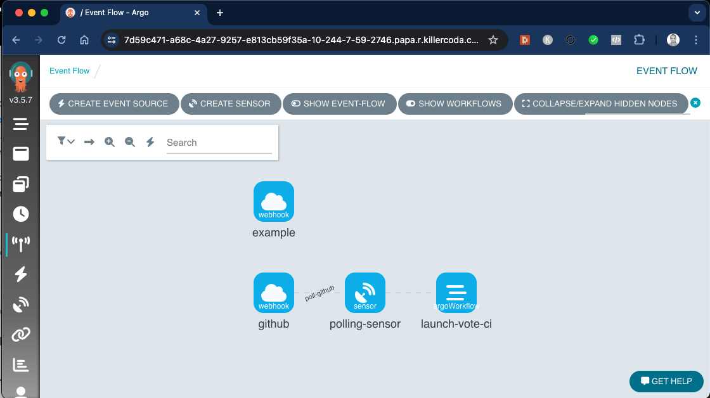
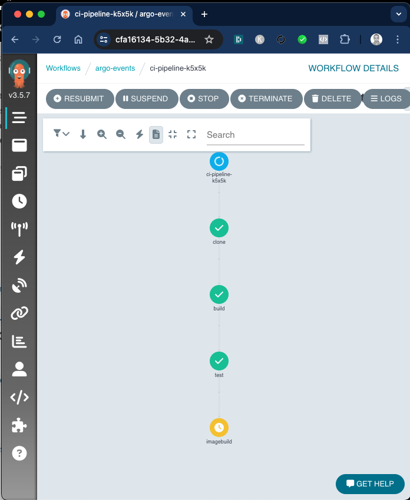

# Argo Events

Author: Gourav Shah  
Publisher: School of Devops  
Version : v2024.06.02.01  
- - -


## Project: Trigger CI Pipeline on GitHub Changes 

Launch [Argo Workflow](https://killercoda.com/argoproj/course/argo-workflows/workflow-examples) Environment with Killercoda , set up server UI and have it open.

Install Argo Events

```
kubectl create namespace argo-events
kubectl apply -f https://raw.githubusercontent.com/argoproj/argo-events/stable/manifests/install.yaml
# Install with a validating admission controller
kubectl apply -f https://raw.githubusercontent.com/argoproj/argo-events/stable/manifests/install-validating-webhook.yaml
kubectl apply -n argo-events -f https://raw.githubusercontent.com/argoproj/argo-events/stable/examples/eventbus/native.yaml

```


Create RBAC Policies

```
kubectl apply -n argo-events -f https://raw.githubusercontent.com/argoproj/argo-events/master/examples/rbac/sensor-rbac.yaml

kubectl apply -n argo-events -f https://raw.githubusercontent.com/argoproj/argo-events/master/examples/rbac/workflow-rbac.yaml
```


Create an Argo Events EventSource and Sensor to handle the events sent by your polling job.

File: `webook-eventsource.yaml`

```
apiVersion: argoproj.io/v1alpha1
kind: EventSource
metadata:
  name: webhook
  namespace: argo-events
spec:
  service:
    ports:
      - port: 12000
        targetPort: 12000
  webhook:
    example:
      port: "12000"
      endpoint: /example
      method: POST

    github:
      port: "12000"
      endpoint: /github
      method: POST

```

apply

```
kubectl apply -f webook-eventsource.yaml
```

Check the Argo Workflow for Vote CI Pipeline converted into a [Workflow Template](https://gist.githubusercontent.com/initcron/c1704b560909f424e66062d86af9ff5c/raw/f7c5f73605a732d358a93854bc2da652113de494/vote-ci-template.yaml).

Create workflow template using this code as

```
kubectl apply -f https://gist.githubusercontent.com/initcron/c1704b560909f424e66062d86af9ff5c/raw/f7c5f73605a732d358a93854bc2da652113de494/vote-ci-template.yaml

```

validate

```
kubectl get workflowtemplate -A

argo template list -A
```


add registry credentials to `argo-events` namespace again with

```
kubectl create secret -n argo docker-registry docker-registry-creds  \
   --docker-server=https://index.docker.io/v1/ \
   --docker-username=xxxx \
   --docker-password=yyyy
```

where replace,  

* `xxxx` with registry username  
* `yyyy` with registry access token  

Add sensor which will listen to updates to `github` webhook created with event source and then trigger the argo workflow as,

File : `sensor.yaml`
```
apiVersion: argoproj.io/v1alpha1
kind: Sensor
metadata:
  name: polling-sensor
  namespace: argo-events
spec:
  template:
    serviceAccountName: operate-workflow-sa
  dependencies:
    - name: poll-github
      eventSourceName: webhook
      eventName: github
  triggers:
    - template:
        name: launch-vote-ci
        argoWorkflow:
          operation: submit
          source:
            resource:
              apiVersion: argoproj.io/v1alpha1
              kind: Workflow
              metadata:
                generateName: ci-pipeline-
              spec:
                workflowTemplateRef:
                  name: vote-ci-template
                arguments:
                  parameters:
                  - name: repo-url
                    value: "https://github.com/xxxxxx/vote.git"
                  - name: branch
                    value: "master"
                  - name: image
                    value: "xxxxxx/vote"
                  - name: dockerfile
                    value: "Dockerfile"

```

where,

* replace `repo-url` with your code repository url  
* update image tag by replacing `xxxxxx` with your docker hub user name  

apply

```
kubectl apply -f sensor.yaml

```

validate

```
kubectl get pods -n argo-events
```

you could also check the logs for sensor controller (useful for troubleshooting) using

```
kubectl logs -n argo-events -l "controller=sensor-controller"
```

you should see a new pod launched to run this sensor.

At this time, if you have Argo Workflow set up, you should see a event flow such as this

Event Flow :




Now, create a Kubernetes CronJob that periodically polls GitHub for new commits. If new commits are found, the job can send an event to the event source webhook created earlier.

File: `poller-cronjob.yaml`

```
---
apiVersion: batch/v1
kind: CronJob
metadata:
  name: github-polling-job
spec:
  schedule: "* * * * *"  # Poll every minute
  jobTemplate:
    spec:
      template:
        spec:
          containers:
          - name: poller
            image: schoolofdevops/github-poller:latest  
            env:
            - name: GITHUB_API_URL
              value: "https://api.github.com/repos/yourusername/yourrepo/commits"
            - name: GITHUB_TOKEN
              valueFrom:
                secretKeyRef:
                  name: github-token-secret
                  key: token
            - name: LAST_COMMIT_FILE
              value: "/data/last_commit.txt"
            - name: ARGO_EVENT_SOURCE_URL
              value: "http://webhook-eventsource-svc.argo-events.svc.cluster.local:12000/github"
            volumeMounts:
            - name: commit-storage
              mountPath: /data
          restartPolicy: OnFailure
          volumes:
          - name: commit-storage
            persistentVolumeClaim:
              claimName: poller-pvc  # Use a PVC to persist the last commit file
---
apiVersion: v1
kind: PersistentVolumeClaim
metadata:
  name: poller-pvc
spec:
  accessModes:
    - ReadWriteOnce
  resources:
    requests:
      storage: 10Mi

```

where,

  * replace value of `GITHUB_API_URL` to match your user name and repo components  e.g. `https://api.github.com/repos/devops-0001/vote/commits`   
  * verify values for all env variables to be correct    

Also create secret with github token with access to the repository, which is used in the cronjob above.

```
kubectl create secret generic github-token-secret --from-literal=token=xxxx
```

replace `xxxx` with actul GitHub access token.

create this cronjob as

```
kubectl apply -f poller-cronjob.yaml
```

now start watching the cronjobs as well as event flow from Argo Workflow dashboard.  


Workflows:


