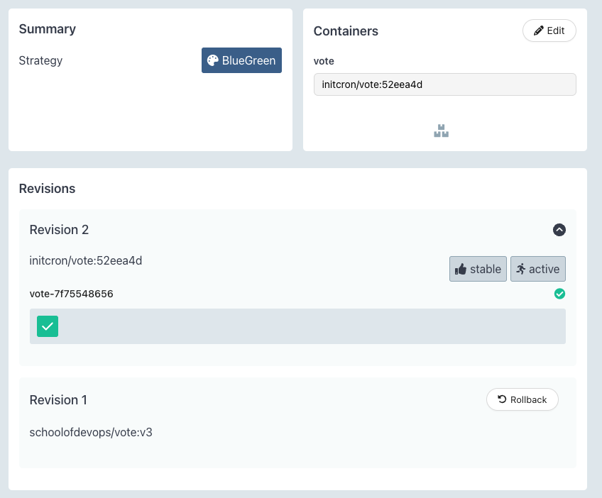

# Argo Image Updater

Author: Gourav Shah  
Publisher: School of Devops  
Version : v2024.06.04.01  
- - -

**Project**: Connect CI Pipeline set up with Argo Workflow and Argo Events with the CD Pipeline created with ArgoCD and Argo Rollouts. Set up a workflow where

  * Whenever there is change to the `main` branch of the application code, it triggers the CI Pipeline with Argo Events + Argo Workflow. The result of this is a new image being published to the container registery.   
  * Set up a watcher which is monitor the container registry, this is where argo image updater comes in. Whenever a new tag with a certain pattern is available in the registry, update the image tag in the `main` branch of the deployment repo with it. Auto commit to GitHub.    
  * Change to the image tag should be automatically picked up by Argo CD and it should trigger the deployment to staging. Since its been integrated with argo rollouts, it implments the release strategy (e.g. Blue/Green) configured with the rollout spec.   
  * Deployment to prod is just one pull request away. Whenever the change (e.g. new image tag) is merged from master to release branch, prod deployment should get triggered based on another application deployment flow set up with Argo CD. And that GitOps in action for you...   


## Set up automatic Image Updater with ArgoCD

Install  [Argo CD Image Updater](https://argocd-image-updater.readthedocs.io/) as,

```
kubectl apply -n argocd -f https://raw.githubusercontent.com/argoproj-labs/argocd-image-updater/stable/manifests/install.yaml
```

Create a  Secret with your GitHub credentials so that the image updater can discover and commit the image tags to git repository.  

```
kubectl -n argocd create secret generic git-creds \
  --from-literal=username=xxxxxx \
  --from-literal=password=ghp_yyyyyy
```

Note : replace `xxxxxx` with your GitHub Username and `ghp_yyyyyy` with GitHub Access Token with write access to repository.  If you do not already have token, create it from GitHub

### Marking Staging Application for Auto Image Updates

When you set up staging deployment, ArgoCD has created a application object for you.  You would need to add a few annotations  to it so that the Image Updater knows that this application is been marked for image auto update.

Observe the existing application created from ArgoCD UI as,

```
kubectl get application -n argocd

kubectl describe application -n argocd vote-staging
```

specifically observe the annotations

```
Annotations:  <none>
```

To update this application with  appropriate annotations create a patch file with the name and content given below,

File : `argo_applications_vote-staging_patch.yaml`

```
metadata:
  annotations:
    argocd-image-updater.argoproj.io/git-branch: main
    argocd-image-updater.argoproj.io/image-list: myimage=xxxxxx/vote
    argocd-image-updater.argoproj.io/myimage.allow-tags: regexp:^[0-9a-f]{7}$
    argocd-image-updater.argoproj.io/myimage.ignore-tags: latest, dev
    argocd-image-updater.argoproj.io/myimage.update-strategy: latest
    argocd-image-updater.argoproj.io/myimage.kustomize.image-name: schoolofdevops/vote
    argocd-image-updater.argoproj.io/myimage.force-update: "true"
    argocd-image-updater.argoproj.io/write-back-method: git:secret:argocd/git-creds
    argocd-image-updater.argoproj.io/write-back-target: "kustomization:../base"
```
Source: [Mark Staging App for Automatic Image Updates from Argo](https://gist.github.com/initcron/ddf79cb9ba9ca940a1263150b586ec60)

Where,

* Replace `xxxxxx/vote` with your own repo in the `argocd-image-updater.argoproj.io/image-list` annotation.  

Apply the above patch as,

```
kubectl patch application --type=merge -n argocd vote-staging --patch-file argo_applications_vote-staging_patch.yaml

```

Validate annotations are added,

```
kubectl describe application -n argocd vote-staging
```

[sample output]
```
...
Labels:       <none>
Annotations:  argocd-image-updater.argoproj.io/git-branch: main
              argocd-image-updater.argoproj.io/image-list: myimage=initcron/argovote
              argocd-image-updater.argoproj.io/myimage.allow-tags: regexp:^[0-9a-f]{7}$
              argocd-image-updater.argoproj.io/myimage.force-update: true
              argocd-image-updater.argoproj.io/myimage.ignore-tags: latest, dev
              argocd-image-updater.argoproj.io/myimage.kustomize.image-name: schoolofdevops/vote
              argocd-image-updater.argoproj.io/myimage.update-strategy: latest
              argocd-image-updater.argoproj.io/write-back-method: git:secret:argocd/git-creds
              argocd-image-updater.argoproj.io/write-back-target: kustomization:../base
API Version:  argoproj.io/v1alpha1
Kind:         Application
...
```

If everything goes well, within a few minutes, you should see a commit to the main branch of the `vote-deploy` repository that you have.


And a few minutes after that, you should see the staging deployment on ArgoCD  pick up the newly updated image tag and deploy it.


You could tally it from Rollout Dashboard that it has picked up the new image with commit hash as tag



and also validate with

```
kubectl describe application -n argocd vote-staging
```

where you should see the following in the output status

```
Summary:
  Images:
    initcron/vote:52eea4d
Sync:
  Compared To:
    Destination:
      Namespace:  staging
      Server:     https://kubernetes.default.svc
    Source:
```

From now, its just matter of creating a pull request and merging it to release branch to deploy to prod.


You could check the logs for the image updater which is running in `argocd` namespace by using a command similar to

```
kubectl logs -f -l "app.kubernetes.io/name=argocd-image-updater" -n argocd
```


Thats all ! If you have gotten till here, congratulate yourself as you have just built a simplistic but completely working modern CI/CD Pipeline ! Hurray !!
