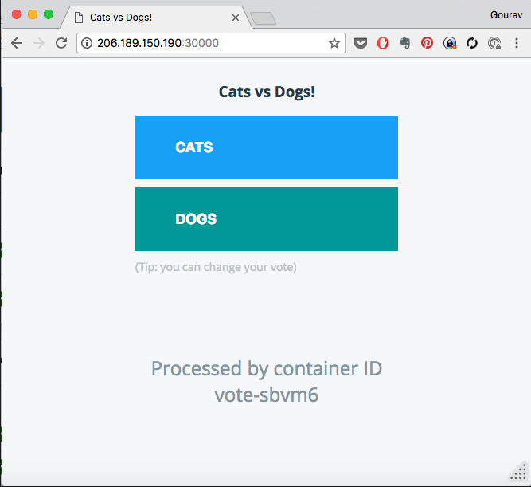
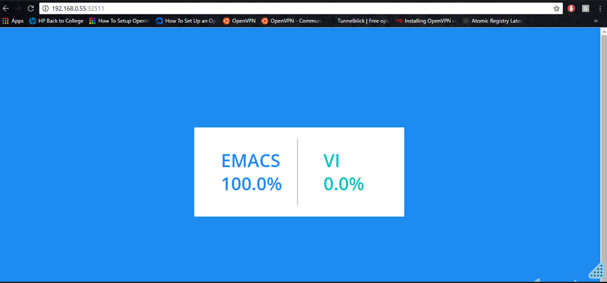

# Lab 03 - Deploy Apps on EKS


In this project , you would write definitions for deploying the [instavote application](https://github.com/schoolofdevops/example-voting-app) stack with all components/tiers which include,

* vote
* redis
* worker
* db
* result


## Project Specs

* Clone the code with `git clone https://github.com/initcron/k8s-code.git` and switch to `k8s-code/projects/instavote/dev` path.
* Apply the deployment and service code for the applications marked as ready
* Complete the code for deployments and services marked as TODO
* Apply the definitions that you have completed
* Validate the application workflow is operational by loading vote and result applications from the browser


⠀
Following table depicts the state of readiness of the above services.

| App | Deployment | Service |
|---|---|---|
| vote | TODO | ready |
| redis | ready | ready |
| worker | TODO | n/a |
| db | ready | ready |
| result | TODO | TODO |

### Phase I - Apply existing code

Create a namespace and switch to it

```
kubectl create namespace instavote
kubectl config set-context --current --namespace=instavote
kubectl config get-contexts
```

Apply the existing manifests

```
cd k8s-code/projects/instavote/dev/

kubectl apply  -f vote-svc.yaml
kubectl apply -f redis-deploy.yaml -f redis-svc.yaml
kubectl apply -f db-deploy.yaml -f db-svc.yaml
```

validate

```
kubectl get all
```

Where you should see,

* deplyoment and services for redis and db created
* nodeport service for vote app

⠀
If you see the above objects, proceed with the next task.

### Phase II - Create Deployments and Services for Remaining Services

You may find the files available in the same directory as above i.e. *k8s-code/projects/instavote/dev/* with either partial or blank code. Your job is to complete the deployment and service yaml specs and apply those. While writing the specs, you could refer to the following specification.

  * vote  
    * image: schoolofdevops/vote:v1  
    * application port: 80  
    * replicas: 2
    * service type: NodePort  
    * nodePort : 30000  
  * worker  
    * image: schoolofdevops/worker:latest  
  * results  
    * image: schoolofdevops/vote-result  
    * application port: 80  
    * replicas: 1
    * service type: NodePort  
    * nodePort : 30100  

⠀
#### To Validate:

```
kubectl get all
```

The above command should show, *five deployments and four services created* services for vote and result app should have been exposed with NodePort

Find out the NodePort for vote and service apps and load those from your browser.



This is how the vote application should look like.

You could also load the Result page on the `30100` port of your Node IP/Address as,



Above is how the result app should look like.

Final validation is, if you submit the vote, you should see the results changing accordingly. You would see this behavior only if all deployments and services are created and configured properly.

### Phase III - Creating a New Node Group

You may notice that your pods are not running or stuck in containerCreating stage. This could be due to the insufficient capacity due to the `t2.micro` instance types.  You could mitigate this by migrating to a new Node Group.

This could be done by adding a new node group e.g.

```

....


managedNodeGroups:
  - name: ng-1-workers
    labels: { role: workers }
    instanceType: t3.small
    desiredCapacity: 1
    minSize: 1
    maxSize: 5
    maxPodsPerNode: 17
    ssh:
      allow: true
      publicKeyName: eks-spore
    tags:
      k8s.io/cluster-autoscaler/enabled: "true"
      k8s.io/cluster-autoscaler/eks-cluster-01: "owned"
    updateConfig:
      maxUnavailable: 1

  - name: ng-2-workers
    labels: { role: workers }
    instanceType: t3.small
    desiredCapacity: 2
    minSize: 1
    maxSize: 4
    maxPodsPerNode: 17
    ssh:
      allow: true
      publicKeyName: eks-spore
    tags:
      k8s.io/cluster-autoscaler/enabled: "true"
      k8s.io/cluster-autoscaler/eks-cluster-01: "owned"
    updateConfig:
      maxUnavailable: 1

```

Notice the `ng-2-workers` node group definition above. It will create a new set of nodes using `t3.medium` instance type.  


To launch the new node group:  

```
eksctl create nodegroup -f cluster.yaml --include=ng-2-workers
```

and to delete the previous one:

```
eksctl delete nodegroup -f cluster.yaml --include=ng-1-workers
```

This should help you migrate the workloads to the new node group and help it run with sufficient resources.

You could also scale it up with

```
eksctl scale nodegroup --cluster eks-cluster-01 ng-2-workers --nodes 2
```
