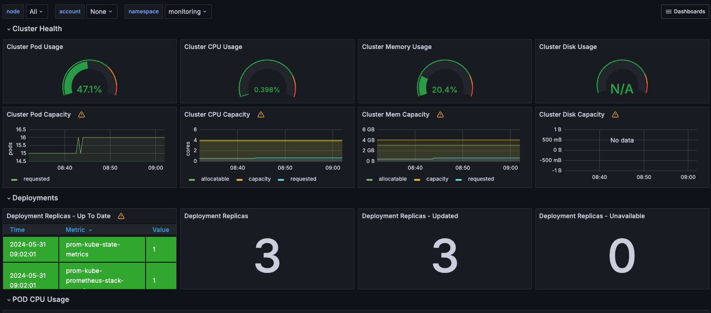

# Lab K205 - Monitoring setup with HELM

In this lab, you are going to install and configure helm, and in turns, use it to configure a monitoring system for kubernetes using prometheus and grafana stack.


## Installing  Helm (version 3)

To install helm version 3 on Linux or MacOS, you can follow following instructions.

```
curl https://raw.githubusercontent.com/helm/helm/master/scripts/get-helm-3 | bash

```

You could further refer to [Official HELM Install Instructions](https://helm.sh/docs/intro/install/) for alternative options.

Verify the installtion is successful,
```
helm --help
helm version
```


## Deploy Prometheus Stack with HELM

Read about [kube-prometheus-stack 33.1.0 · prometheus/prometheus-community](https://artifacthub.io/packages/helm/prometheus-community/kube-prometheus-stack) chart at artifacthub.io

Add helm repository using ,

```
helm repo add prometheus-community https://prometheus-community.github.io/helm-charts
helm repo update

```

Download the  chart as,

```
cd ~
helm fetch --untar prometheus-community/kube-prometheus-stack

```

Change into the charts directory

```
cd kube-prometheus-stack/
ls
```

Deploy prometheus stack as,

```
kubectl create ns monitoring
helm install prom -n monitoring prometheus-community/kube-prometheus-stack

```

Validate

```
helm list -A

kubectl get all -n monitoring
kubectl get pods,svc -n monitoring
```

#### Customising Prometheus Configurations

To update the Grafana service to use NodePort configurations, upgrade the helm release by setting up  customized properties as,

```
helm upgrade prom -n monitoring prometheus-community/kube-prometheus-stack \
  --set grafana.service.type=NodePort \
  --set grafana.service.nodePort=30200
```

Validate

```
helm list -A

kubectl get svc -n monitoring
```

You should see new revision of monitoring stack deployed, and Grafana service changed to NodePort.

Note down the node port and access Grafana with

http://IPADDRESS:30200

`remember to replace node name/ip address and node port as actual.`

Login using

```
User : admin
Pass: prom-operator
```

Once logged in, you should be able to browse and view Grafana dashboards from `Dashboards` menu.

An example dashboard is as follows,


You could further explore various Grafana dashboards and configurations.


## Import EKS Dashboard

You could import [EKS Specific Dashboard](https://grafana.com/grafana/dashboards/17119-kubernetes-eks-cluster-prometheus/) onto grafana using the following instructions.


  * From Dashboards -> New -> Import   
  * Provide Dashboard ID as `17119` , select Load
  * Select Prometheus Data Source instance
  * Import

Once imported,

  * go to Dashboard Settings -> Variables
  * select `node`
  * on configuration page,Query options  -> Query select Metric as `kube_pod_info`
  
  * Ensure Label is set to `node`
  * Save Dashboard

When you switch back to the dashboard you should see cluster health




You could try installing additional dashboards e.g.

  * Node Exporter: [](https://grafana.com/grafana/dashboards/1860-node-exporter-full/)  
  * Cluster Autoscaler: [](https://grafana.com/grafana/dashboards/3831-autoscaler/)    
  * Node Exporter for Prometheus: [](https://grafana.com/grafana/dashboards/15172-node-exporter-for-prometheus-dashboard-based-on-11074/)  

## Uninstalling the App with HELM
Once you are done experiementing and learning, you could uninstall the application stack that you earlier installed with helm easily.

To uninstall prometheus and grafana stack, begin by listing it

```
helm list -A
helm uninstall -n monitoring prom
```

This should clean up everything that was deployed with helm earlier.


## Summary

In this lab, we not only learnt about HELM, a kubernetes package manager, but  also have setup a sophisticated health monitoring system with prometheus and grafana.
